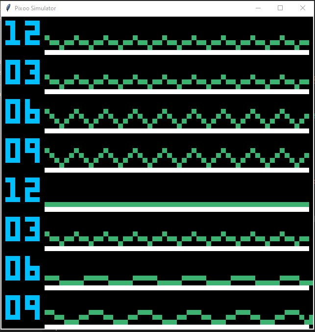

# Pixoo Swell Clock

Swell Clock Display for Pixoo 64 using data from the Magic Seaweed and SomethingWithComputers' Pixoo Library

Display is only using Pixoo Tkinter simulator. Integration with Pixoo 64 TBD 

# Create virutal environment

python -m venv venv

# Activate virtual environment

Windows: venv\Scripts\activate.bat
Linux: source venv/bin/activate

# Install Requirements

pip install -r requirements.txt

# Run Display

python swell.py

